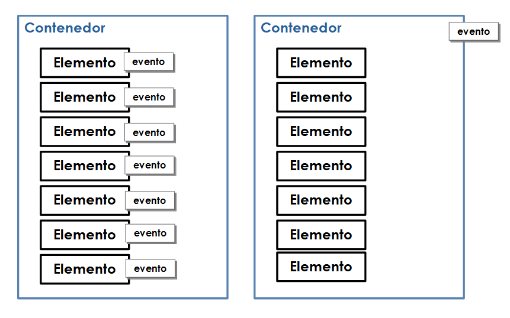

# 5.1.6 Delegación de eventos

Este flujo a la hora de ejecutar eventos permite algo muy interesante que se puede utilizar para optimizar el código, se trata de la **delegación de eventos**. En el caso de tener un contenedor con varios elementos dentro a los que hay que colocar un evento, la idea inicial sería añadir un evento a cada uno de los elementos contenidos
recorriendo uno a uno. La solución funciona de manera óptima con escasos elementos, pero ¿y si fueran un número elevado? El rendimiento caería hasta límites insoportables.

Además, si fuese necesario incluir nuevos elementos dentro del contenedor habría que tener en cuenta añadir el evento antes o después de introducirlo en el contenedor. Otra tarea extra.

Con la delegación de eventos (más concretamente con el flujo) si se añade un evento a un objeto éste podrá ser disparado por un elemento contenido, es decir, un elemento *child*. De esa forma tan sólo hay que añadir un evento al contenedor y no a cada uno de los elementos que contiene. Eso sí, si conviven diferentes tipos de elementos en el contenedor habrá que comprobar cuál ha sido el que ha generado el evento y actuar en consecuencia.

